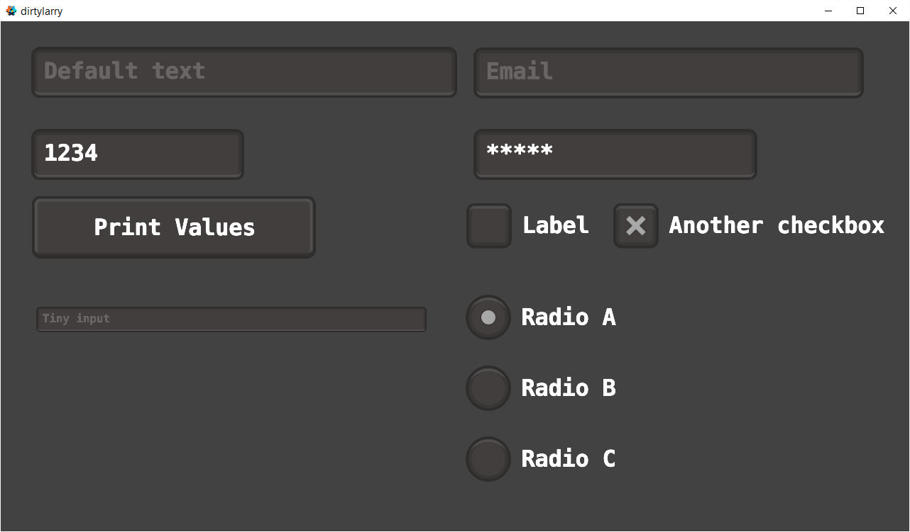
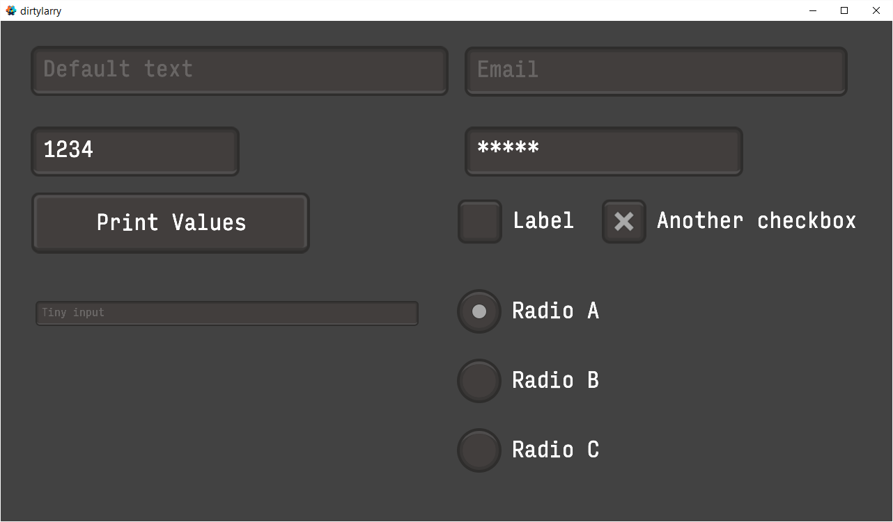

# dirtylarry
A quick and dirty GUI library for [Defold](https://www.defold.com/).

# Usage
1. Add latest zip URL as a [dependency](http://www.defold.com/manuals/libraries/#_setting_up_library_dependencies) in your Defold project: `https://github.com/andsve/dirtylarry/archive/master.zip`

2. Add one of the supplied GUI template files, located in `dirtylarry/*.gui`, to your GUI scene.

3. In your GUI script, add `local dirtylarry = require "dirtylarry/dirtylarry"` to the top and make sure the script has [acquired input focus](http://www.defold.com/manuals/input/#_acquiring_and_releasing_input_focus).

4. Then add the corresponding function inside your `on_input`:
    * `dirtylarry/input.gui`:
    ```Lua
    dirtylarry:input("node_id", action_id, action, gui.KEYBOARD_TYPE_DEFAULT, "Default text")
    ```
    * `dirtylarry/button.gui`:
    ```Lua
    dirtylarry:button("node_id", action_id, action, function ()
        print("button was pressed")
    end)
    ```
    * `dirtylarry/checkbox*.gui`:
    ```Lua
    self.checkbox_value = dirtylarry:checkbox("node_id", action_id, action, self.checkbox_value)
    ```
    * `dirtylarry/radio*.gui`:
    ```Lua
    self.radio_value = dirtylarry:radio("node_a_id", action_id, action, "a", self.radio_value)
    self.radio_value = dirtylarry:radio("node_b_id", action_id, action, "b", self.radio_value)
    ```

5. In the `input/game.input_binding`, add the following triggers:
   * *Key Triggers*: Input: `key-backspace`, Action: `backspace`
   * *Mouse Triggers*: Input: `mouse-button-1`, Action: `touch`
   * *Text Triggers*: Input: `text`, Action: `text`
   * *Text Triggers*: Input: `marked-text`, Action: `marked_text`
   
For more usage examples take a look at [main/examples.gui_script](main/examples.gui_script) and [dirtylarry/dirtylarry.lua](dirtylarry/dirtylarry.lua) for configurational options.

## Examples
* Using the built in font:

* Using [Input](http://input.fontbureau.com/) font:

